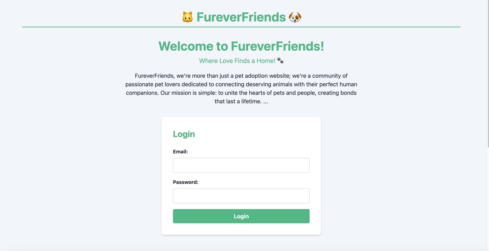
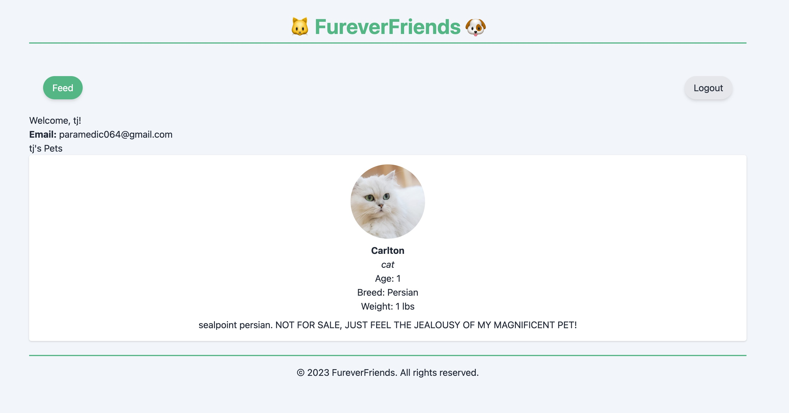

# FureverFriends Pet Adoption Network
Where passionate people meet their pets.

## Who we are
We wanted to create a space that focuses on the pets and not the business of pets. With our soon to come wishlist feature, we are hoping to connect pets to people and vice versa. We are also excited to create a community of pet lovers that will support one another in caring for these wonderful creatures.

## How to use our site

Using FureverFriends is incredibly simple. If you have not created a profile, fill out the signup form with your name, email, and desired password and  then click sign-up. If you already have a login, enter your email and password and click login. Once you login you will be redirected to the feed page where you will see a list of amazing pets available. On the top of the page you will see an option to list a pet, go to your profile, or logout.

The list a pet option will bring you to a form that allows you to enter details about the animal you would like to rehome to a loving family. You will be asked details such as the pets name, age, type and breed, weight, and description. Please use the description box to describe the pets personality as well as the best way to get in contact with you for a smooth re-homing process. Please note that your email must be the same email as the one you login with. This is a verification to make sure no one lists scam pets under your name.

Your profile is your home on our site. You will see your name, registered email, and the pet's you have listed for sale. There will be an option to return to the feed page or to logout.

It is as simple as that. Our site is dedicated to remaining intuitive and simple to use. That does'nt mean we don't have some incredible updates coming soon, so keep on the look out for those!

## Installation

There is no installation necessary to enjoy our site. Simply visit the link below and enjoy the web based application. We hope soon you will be able to find us in your app store for a seamless mobile experience too.

## Upcoming Features

There are so many great things in the works. Here are some upcoming features we are excited about:
- We are working on a mobile app so you can enjoy FureverFriends on the go.
- A wishlist for your profile will soon allow you to post pets your looking for.
- We hope to create a more engaging network, giving you ways to communicate with other pet lovers.
- We are looking for a way to integrate with shelters local to your area so they are able to return lost pets and re-home animals to loving families.

## What we learned

In development, our group learned alot about routing and backend code. We can see the benefits to having a MVC style structure to the code. Roles could more clearly be set when you have such a big project to work on.

Handlebars was a nice technology to learn but we probably wont use it again in the future. Tailwind CSS was a great way to style our page.

using express-sessions and authentication helped us to secure the users profile, while bcrypt helped secure the stored login information. Learning this code will be extremely useful in future projects.

## Deployed App

[FureverFriends](https://pure-scrubland-49342-080c7f0b82aa.herokuapp.com/)

## Screenshots
Homepage:

Profile:

## Source Code

No source code was provided. The group collaborated nicely, and evenly split up the work while supporting each other through the debugging process. Some code snippets from the UofO coding bootcamp activities were adopted to fit this project. 
